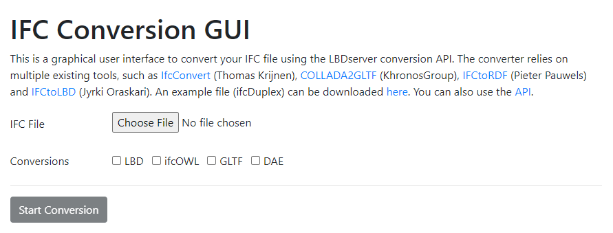

# Front end (React) for the converter tool (conversion of IFC to LBD-RDF, ifcOWL, COLLADA, glTF).

## Before installation
You need:
- Java version 8+
- a running version of the back-end to this code: https://github.com/LBDserver/converter_backend/

## Installation and getting started
Open console and run:
- `npm install`
- `npm run start`

## What can this web-app do
After starting the server, a local web application starts that allows converting IFC to a number of other data formats:

